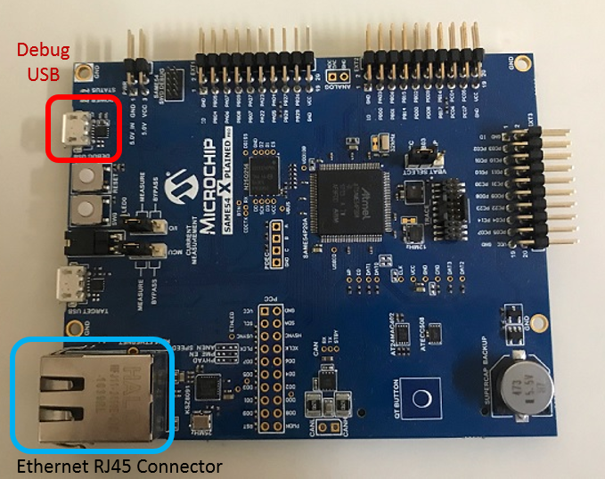
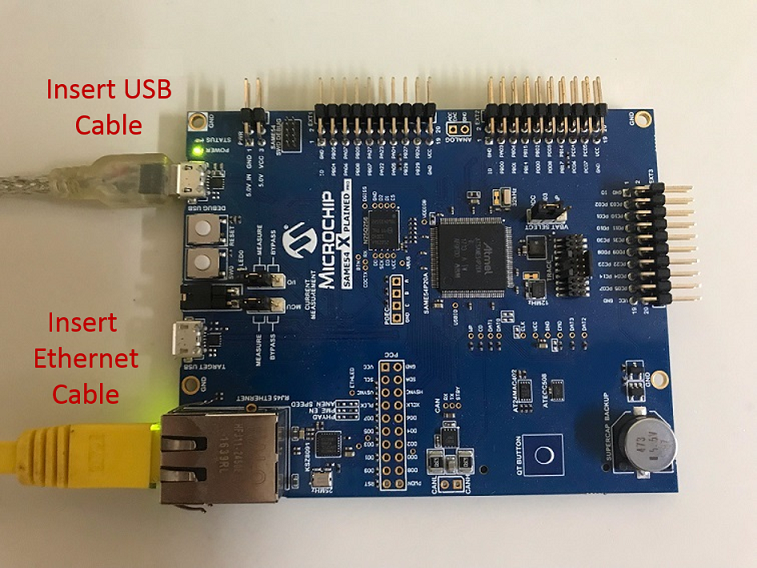

# TCP/IP TCP Server Hardware Configuration

This is the following section describes the hardware configuration used for this application demonstration.

1. This section describes the required default hardware configuration use USB device as **on board debugger and programmer** for this application demonstration.
    * No hardware related configuration or jumper setting changes are necessary

    * Refer to the SAM E54 Ethernet Starter Kit [User Guide](http://ww1.microchip.com/downloads/en/DeviceDoc/70005321A.pdf)

      

    * Connect the micro USB cable from the computer to the DEBUG USB connector on the SAM E54 Xplained Pro Evaluation Kit
    * Establish a connection between the router/switch with the SAM E54 Xplained Pro Evaluation Kit through the RJ45 connector

     

